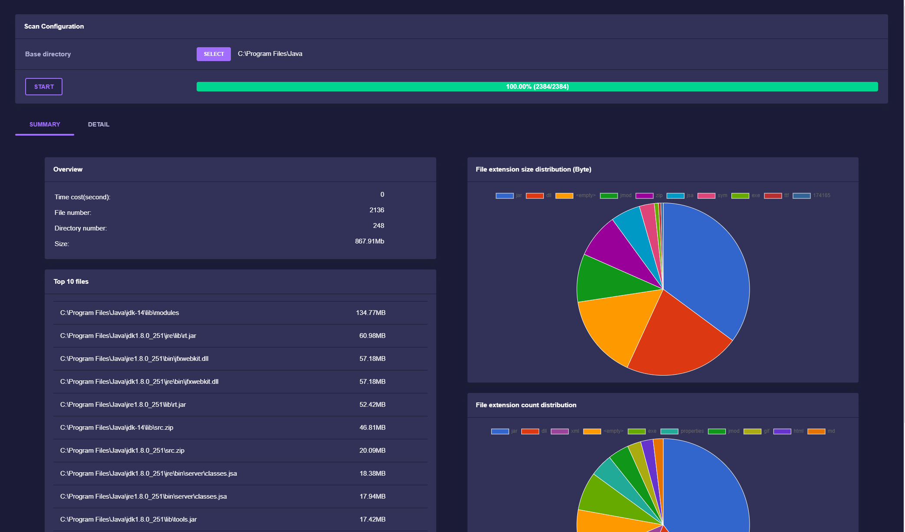
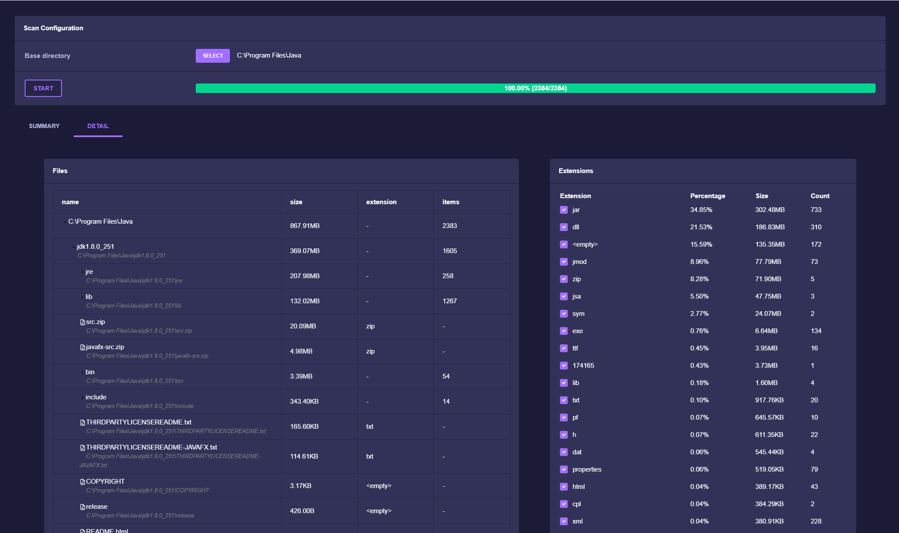

<!-- ABOUT THE PROJECT -->
## About The Project




If you want to know size of each directory/file quickly, to figure out why your disk is full, this tool can help you.

It can:
* List size/count of all files under specific directory
* Filter files with extensions

### Built With
* [Java](https://www.oracle.com/java/)
* [maven](https://maven.apache.org/)
* [Log4j](https://logging.apache.org/log4j/2.x/)
* [Springboot](https://spring.io/projects/spring-boot)
* [Node](https://nodejs.org)
* [Angular](https://angular.io)
* [Electron](https://www.electronjs.org)


<!-- GETTING STARTED -->
## Getting Started

### Prerequisites

1. JDK 8+
2. Maven 3.5+
3. Node 10+

### Quick start

Install necessary library:
```
npm install
```

Launch backend (requires port 8080)
```
npm run start:backend
```

Open another console, to launch frontend (requires port 4200)
```
npm run start:frontend
```


<!-- ### Configuration

Prepare configuration file
1. **threadNum**: Thread number used to scan disk. Recommand to set core number + 1
2. **baseDir**: Root directory for scan
3. **excludedPaths**: File/Folder list which excluded from scan. Wildcard is supported
4. **outputTypes**: The way to output scan result. Support values: *Console* and *File*
5. **fileOutputLoc**: If *outputTypes* contains *File*, specify the folder to put output files
6. **fileSizeUnit**: File output size unit. Support values: *Kb*, *Mb*, *Gb*
7. **dirSizeUnit**: Folder output size unit. Support values: *Kb*, *Mb*, *Gb*
8. **dirSizeUnit**: Top N size file should be included in output. *-1* means all files.

```json
{
	"threadNum": 5,
	"baseDir": "C:\\Users\\xichen\\tool",
	"excludedPaths": [
		"C:\\Users\\xichen\\tool\\boot",
		"*.jar"
	],
	"outputTypes": [
		"Console",
		"File"
	],
	"fileOutputLoc": "C:\\Users\\xichen\\testoutput",
	"fileSizeUnit": "Kb",
	"dirSizeUnit": "Mb",
	"fileTopCount": -1 
}
```

## Usage

After building with maven, one jar named *diskscanner-xxx-SNAPSHOT.jar* and one *dependency* folder will be generated in "target". Create confiration file according to your requirement. Run command
```
java -jar diskscanner-xxx-SNAPSHOT.jar your-config.json
``` -->
